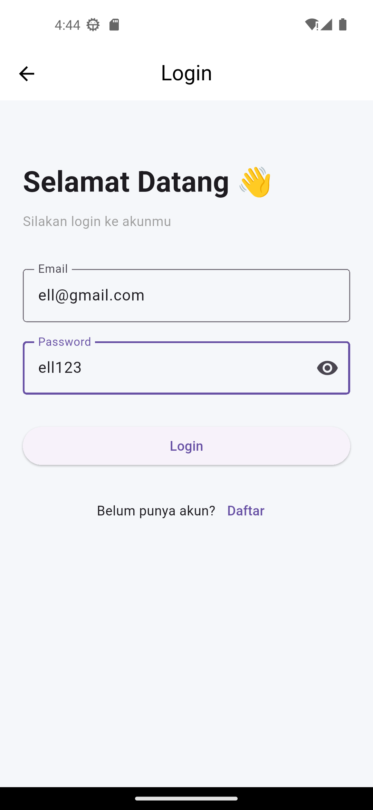
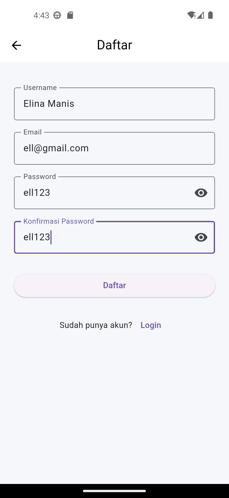
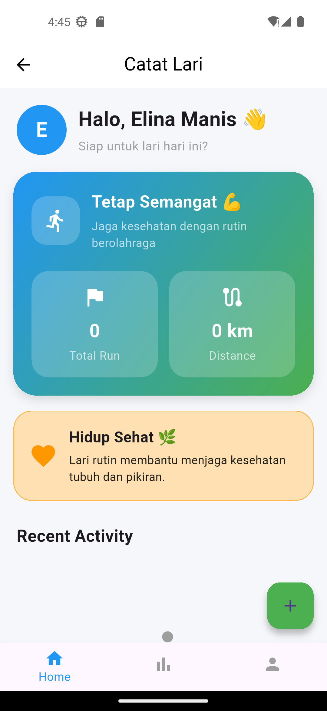
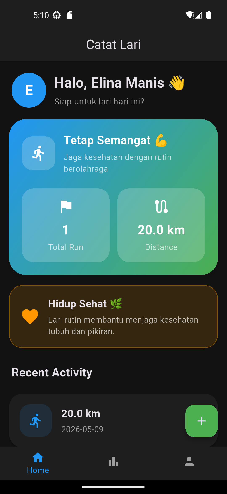
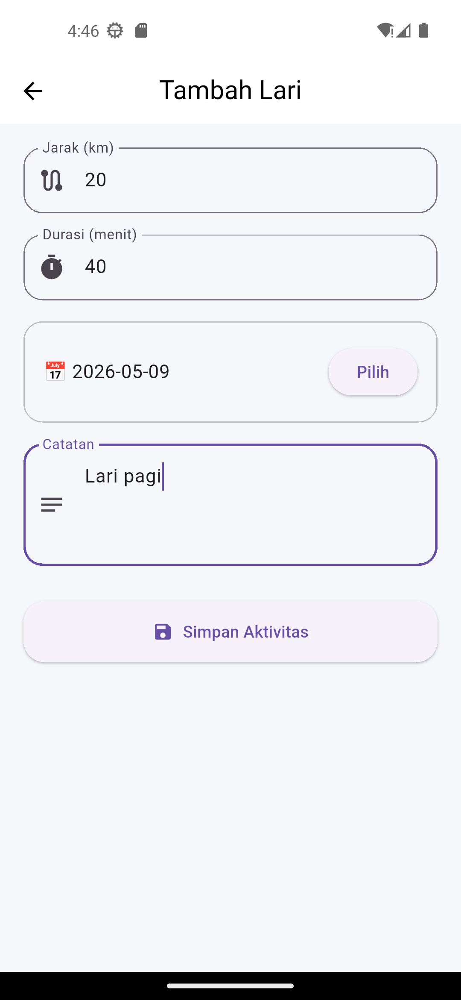
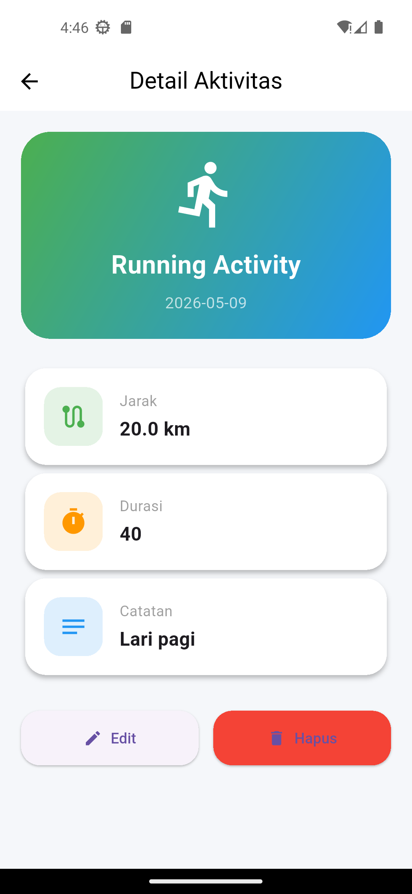
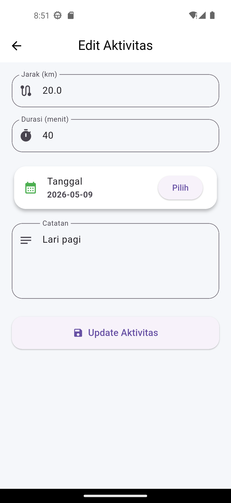
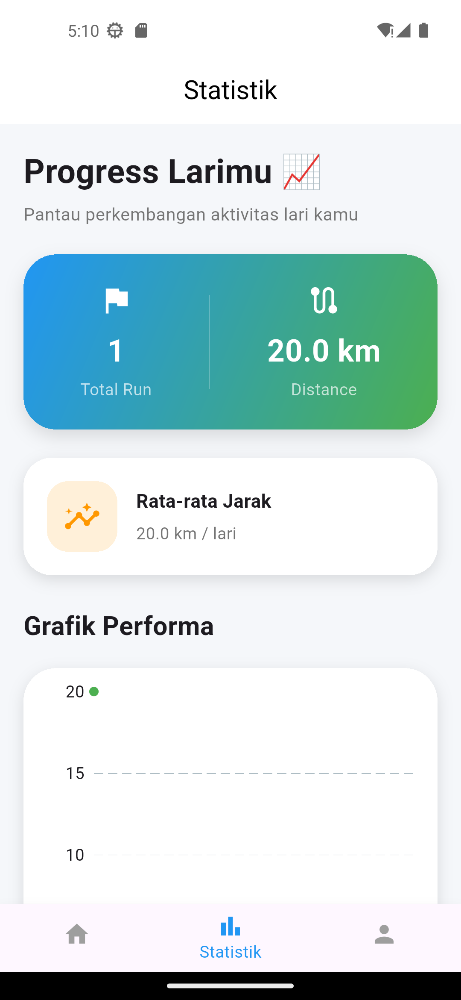
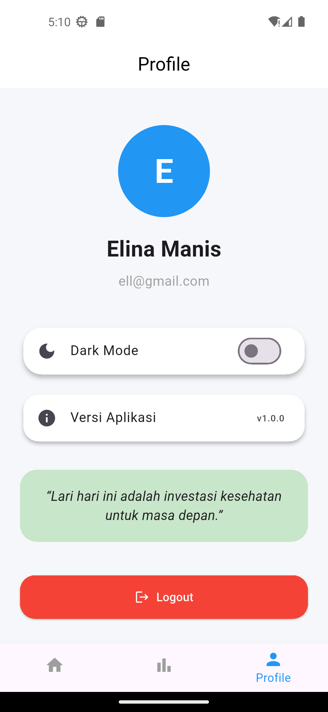

# 🏃‍♂️ Catat Lari

Aplikasi mobile Flutter untuk mencatat aktivitas lari harian dengan tampilan modern, statistik aktivitas, grafik lari, dan sistem autentikasi menggunakan SQLite.

---

# 📱 Demo Aplikasi

## ✨ Fitur Utama

- 👋 Welcome Screen
- 🔐 Login & Register (Auth System)
- 🏠 Home Dashboard aktivitas lari
- ➕ Add Run (Tambah data lari)
- 📋 Detail Run
- ✏️ Edit Run
- 📊 Statistik & Grafik aktivitas
- 👤 Profile User
- 🚪 Logout
- 🧭 Bottom Navigation
- 🌙 Dark Mode
- 🎨 Modern UI Design

---

# 🚀 Teknologi yang Digunakan

- Flutter
- Dart
- SQLite (sqflite)
- fl_chart
- Material Design

---

# 📂 Struktur Folder

```bash
lib/
│   main.dart
│
├── data/
│   └── user_data.dart
│
├── database/
│   ├── auth_service.dart
│   ├── db_helper.dart
│   └── session.dart
│
├── models/
│   ├── run.dart
│   └── user.dart
│
├── views/
│   ├── auth/
│   │   ├── login_screen.dart
│   │   └── register_screen.dart
│   │
│   ├── home/
│   │   └── home_screen.dart
│   │
│   ├── navigation/
│   │   ├── bottom_nav_screen.dart
│   │   └── main_navigation.dart
│   │
│   ├── profile/
│   │   └── profile_screen.dart
│   │
│   ├── run/
│   │   ├── add_run_screen.dart
│   │   ├── detail_run_screen.dart
│   │   └── edit_run_screen.dart
│   │
│   ├── splash/
│   │   └── splash_screen.dart
│   │
│   ├── statistic/
│   │   └── statistic_screen.dart
│   │
│   └── welcome/
│       └── welcome_screen.dart
│
└── widgets/
```

---

# ✨ Tampilan Aplikasi

## 👋 Welcome Screen
Halaman awal sebelum login atau register.

## 🔐 Auth Screen
- Login menggunakan akun terdaftar
- Register akun baru

## 🏠 Home Screen
- Daftar aktivitas lari
- Dashboard total run & distance
- Banner motivasi kesehatan

## ➕ Add Run
Menambahkan data aktivitas lari baru.

## 📋 Detail Run
Menampilkan detail aktivitas lari.

## ✏️ Edit Run
Mengubah data aktivitas lari.

## 📊 Statistik
- Grafik aktivitas lari menggunakan fl_chart
- Analisis progress lari

## 👤 Profile
- Informasi user
- Logout akun

## 🌙 Dark Mode
UI modern dengan tema gelap.

---

## 📸 Screenshot Aplikasi

### 👋 Splash Screen


### 🔐 Login Screen


### 📝 Register Screen


### 🏠 Home Screen Light


### 🌙 Home Screen Dark


### ➕ Add Run


### 📋 Detail Run


### ✏️ Edit Run


### 📊 Statistic Screen


### 👤 Profile Screen


---

# ⚙️ Cara Menjalankan Project

## 1. Clone Repository
```bash
git clone https://github.com/riskyhelen05/catat_lari.git
```

## 2. Masuk Folder Project
```bash
cd catat_lari
```

## 3. Install Dependency
```bash
flutter pub get
```

## 4. Jalankan Aplikasi
```bash
flutter run
```

---

# 📌 Dependencies

Tambahkan pada `pubspec.yaml`:

```yaml
dependencies:
  flutter:
    sdk: flutter

  cupertino_icons: ^1.0.8
  sqflite: ^2.3.0
  path: ^1.8.3
  provider: ^6.0.5
  shared_preferences: ^2.2.2
  fl_chart: ^0.68.0
```

---

# 👨‍💻 Developer

**Helen Risky Dwi Wahyuni (24082010054)**  
Flutter Mobile Developer
- Membangun UI aplikasi Flutter
- Mengimplementasikan SQLite database
- Membuat sistem login & session
- Membuat fitur CRUD aktivitas lari
- Mengembangkan statistik & grafik aplikasi

---

# 📹 Video Demo

https://drive.google.com/drive/folders/14SAwvry-7f893_SUOA6B8vObUMJE_r4y

---

# 🏁 Hasil Akhir

Aplikasi ini berhasil mengimplementasikan:

- Clean UI Flutter
- Authentication System
- SQLite CRUD
- Statistik & Grafik
- Session Management
- Navigation System
- Dark Mode
- Responsive Mobile Design
